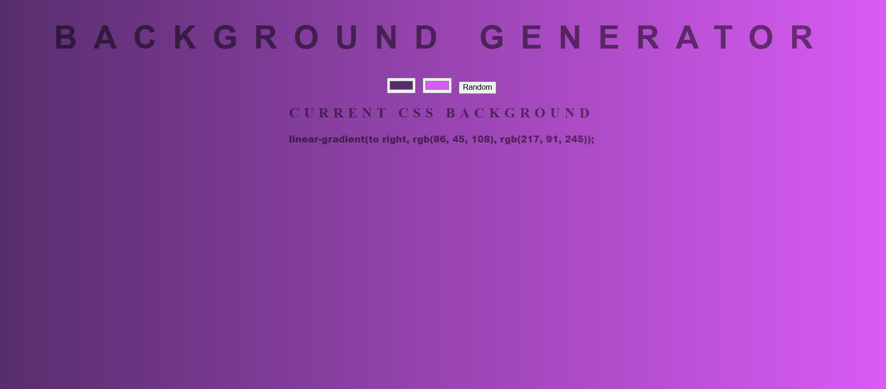

# Gradient Background Generator

A simple and interactive **Gradient Background Generator** that allows users to create and customize gradient backgrounds. Users can select colors or generate random gradients and view the corresponding CSS code for seamless integration into their projects.

## Table of Contents
- [Features](#features)
- [Technologies Used](#technologies-used)
- [Setup](#setup)
- [Usage](#usage)
- [Screenshot](#screenshot)
- [License](#license)

---

## Features
- Choose two colors to create a gradient background.
- Instantly view the CSS code for the current gradient.
- Generate random gradients with a single button click.
- Responsive and clean design for better usability.

## Technologies Used
- **HTML5** for the webpage structure.
- **CSS3** for styling, including gradients and typography.
- **JavaScript (ES6)** for interactive functionality, such as updating the background dynamically.

---

## Setup
1. Clone this repository or download the files:
   ```bash
   git clone https://github.com/Abdulrahman843/gradient-background-generator.git
2. Open the project folder and ensure you have the following files:
	  index.html
	  style.css
	  script.js
	  backgroundGenerator.jpg
3. Open the index.html file in a web browser to view the application.

## Usage
Select Colors:
Use the two color pickers to choose the starting and ending colors of the gradient.
View CSS:
The CSS code for the gradient will appear below the inputs, allowing you to copy and use it in your projects.
Generate Random Gradients:
Click the Random button to instantly generate a random gradient.

## Screenshot
Below is a screenshot of the Gradient Background Generator:


## License
This project is licensed under the MIT License. Feel free to use, modify, and distribute as needed.
